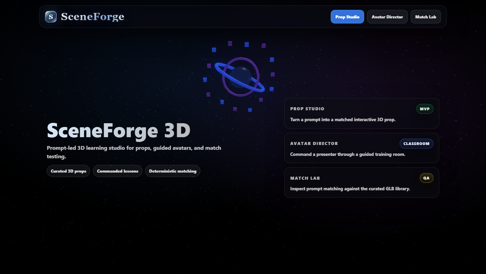
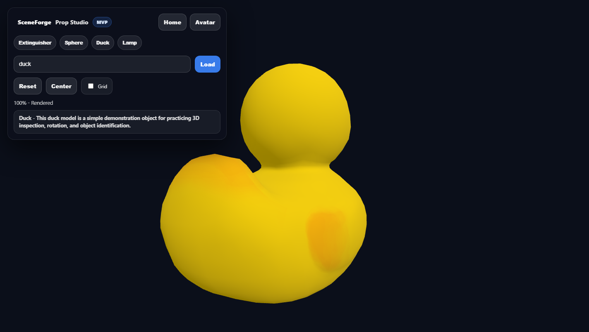
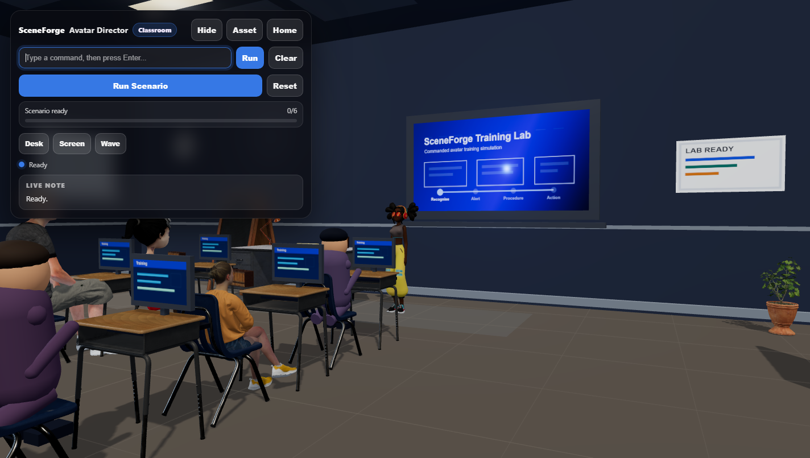

# SceneForge 3D

SceneForge 3D is a browser-based 3D learning studio. It turns learner prompts into curated 3D props, runs a command-driven avatar classroom, and includes a QA lab for prompt matching.



## Modes

| Mode | Route | Purpose |
| --- | --- | --- |
| Prop Studio | `/?mode=asset` | Matches a prompt to a curated GLB prop and renders it in Three.js. |
| Avatar Director | `/?mode=avatar` | Runs a classroom scene where typed commands drive a presenter avatar. |
| Match Lab | `/?mode=test` | Tests deterministic prompt-to-prop matching without loading the full viewer. |

## Screens





## Local Run

```bash
npm install
npm run dev
```

Open the Vite URL shown in the terminal.

## Build

```bash
npm run build
npm run preview
```

## How It Works

- Vite serves the app shell and mode router.
- Three.js renders the landing scene, prop viewer, and avatar classroom.
- `api/model.js` performs deterministic prompt matching against `public/assets/library/index.json`.
- The app uses curated GLB/FBX assets. It does not generate brand-new 3D geometry from AI prompts.

## Key Folders

```text
api/                         Local/Vercel API handlers
public/assets/library/       Curated GLB prop library
public/avatar/               Avatar, student, and classroom assets
src/                         Three.js modes and app router
index.html                   App shell and UI styling
```

